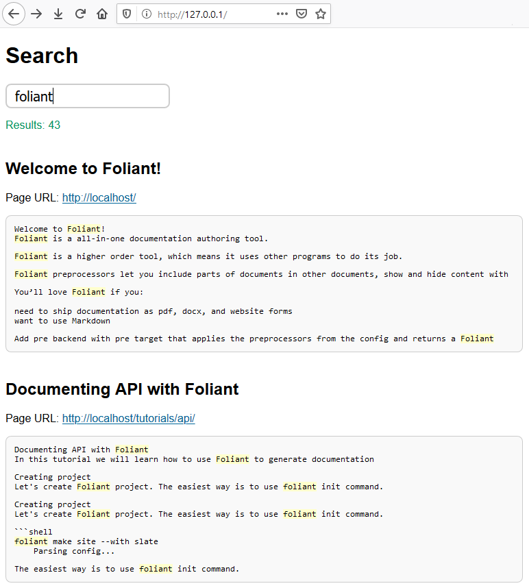

# Elasticsearch Preprocessor

This extension allows to integrate Foliant-managed documentation projects with [Elasticsearch](https://www.elastic.co/guide/en/elasticsearch/reference/current/elasticsearch-intro.html) search engine.

The main part of this extension is a preprocessor that prepares data for a search index.

Also this extension provides a simple working example of a client-side Web application that may be used to perform searching. By editing HTML, CSS and JS code you may customize it according to your needs.

## Installation

To install the preprocessor, run the command:

```bash
$ pip install foliantcontrib.elasticsearch
```

To use an example of a client-side Web application for searching, download [these HTML, CSS, and JS files](https://github.com/foliant-docs/foliantcontrib.elasticsearch/tree/master/webapp_example/) and open the file `index.html` in your Web browser.

## Config

To enable the preprocessor, add `elasticsearch` to `preprocessors` section in the project config:

```yaml
preprocessors:
    - elasticsearch
```

The preprocessor has a number of options with the following default values:

```yaml
preprocessors:
    - elasticsearch:
        es_url: 'http://127.0.0.1:9200/'
        index_name: ''
        index_properties: {}
        actions:
            - create
        use_chapters: true
        url_transform:
            - '\/?index\.md$': '/'
            - '\.md$': '/'
            - '^([^\/]+)': '/\g<1>'
        targets: []
```

`es_url`
:   Elasticsearch API URL.

`index_name`
:   Name of the index. Your index must have an explicitly specified name, otherwise API URL will be invalid.

`index_properties`
:   Settings and other properties that should be used when creating an index. If not specified, the default settings will be used. More details are described below.

`actions`
:   List of actions that the preprocessor should to perform. Available values are: `delete`, `create`. Often it is needed to remove and then fully rebuild the index.

`use_chapters`
:   If set to `true`, the preprocessor applies only to the files that are mentioned in the `chapters` section of the project config. Otherwise, the preprocessor applies to all of the files of the project.

`url_transform`
:   Sequence of rules to transform local paths of source Markdown files into URLs of target pages. Each rule should be a dictionary. Its data is passed to the [`re.sub()` method](https://docs.python.org/3/library/re.html#re.sub): key as the `pattern` argument, and value as the `repl` argument. The local path (possibly previously transformed) to the source Markdown file relative to the temporary working directory is passed as the `string` argument. The default value of the `url_transform` option is designed to be used to build static websites with MkDocs backend.

`targets`
:   Allowed targets for the preprocessor. If not specified (by default), the preprocessor applies to all targets.

## Usage

The preprocessor reads each source Markdown file and generates three fields for indexing:

* `url`—target page URL;
* `title`—document title, it is taken from the first heading of source Markdown content;
* `text`—source Markdown content converted into plain text.

When all the files are processed, the preprocessor calls Elasticsearch API to create the index.

Optionally the preprocessor may call Elasticsearch API to delete previously created index.

By using the `index_properties` option, you may override the default Elasticsearch settings when creating an index. Below is an example of JSON-formatted value of the `index_properties` option to create an index with Russian morphology analysis:

```json
{
    "settings": {
        "analysis": {
            "filter": {
                "ru_stop": {
                    "type": "stop",
                    "stopwords": "_russian_"
                },
                "ru_stemmer": {
                    "type": "stemmer",
                    "language": "russian"
                }
            },
            "analyzer": {
                "default": {
                    "tokenizer": "standard",
                    "filter": [
                        "lowercase",
                        "ru_stop",
                        "ru_stemmer"
                    ]
                }
            }
        }
    }
}
```

You may perform custom search requests to Elasticsearch API.

The [simple client-side Web application example](https://github.com/foliant-docs/foliantcontrib.elasticsearch/tree/master/webapp_example/) that is provided as a part of this extension, performs requests like this:

```json
{
    "query": {
        "multi_match": {
            "query": "foliant",
            "type": "phrase_prefix",
            "fields": [ "title^3", "text" ]
        }
    },
    "highlight": {
        "fields": {
            "text": {}
        }
    },
    "size": 50
}
```

Search results may look like that:



If you use self-hosted instance of Elasticsearch, you may need to configure it to append [CORS](https://developer.mozilla.org/en-US/docs/Web/HTTP/CORS) headers to HTTP API responses.
